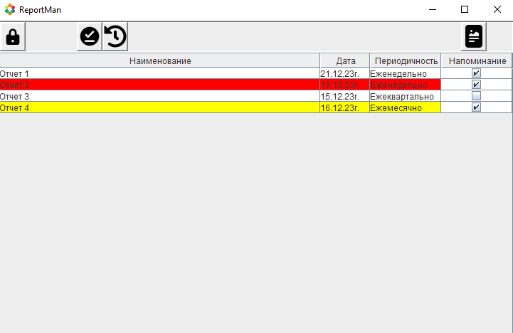
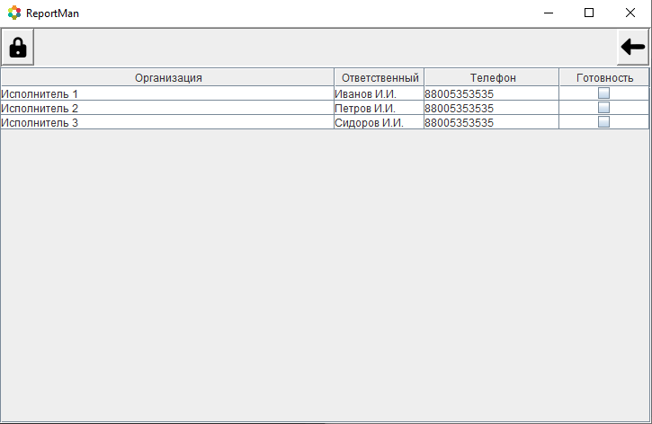

# Это ReportMan 
#### "ReportMan"  разработано полностью на JAVA.
#### Целью его разработки, стало создание удобной среды для мониторинга отчетов по их поставщикам.
#### Необходимостью появления данного ПО, послужила смена операционных систем на отечественные версии Linux  и отказ от MS Office, что сделало не возможным использовать Excel и его инструменты автоматизации.

## Актуальная версия: [reportman-0.0.1.jar](reportman-0.0.1.jar)

 История версий:

- 14.12.2023г. [reportman-0.0.1.jar](reportman-0.0.1.jar). 

### *Для запуска ReportMan потребуется JRE'.*
JRE - Java Runtime Environment — минимальная реализация виртуальной машины, необходимая для работы Java-приложений

### Функциональность и описание: 
1. Приложение разработано на JAVA 8.
2. В разработке использовался Lombok, Swing и sqlite-jdbc:
2. Приложение работает с базой данных SQLite, которая создается при первом запуске в локальной папке приложения /date/report.db
### Кнопки:
  -  разрешает редактирование поля.
  -  запрещает редактирование поля.
  -  добавляет новую строку.
  -  удаляет строку.
  -  завершает отчет.
  -  открывает историю.
  -  закрывает историю.
  -  сохраняет последние изменения.
  -  добавляет документ к отчету.
  -  открывает документ выделенного отчета.
  -  взвращает в список отчетов.

### Работа с приложением:
- При входе в приложение мы поподаем в список отчетов:

1. У каждого отчета имя должно быть уникальным, при создании идентичного имени будет перезаписан существующий отчет по его характеристикам.
2. Дата может быть любой, а при условии включенного напоминания:
   - От 5 до 2х дней до срока, строка становится желтой.
   - За один день и ***до его завершения***, он будет гореть красным.
3. Все кнопки при наведении становятся информативными.
4. При завершении отчета, он переносится в историю, откуда его можно восстановить если потребуется. 
5. К каждому отчету можно прикрепить документ.
- При двойном нажатии по строке отчета, мы проваливаемся в исполнителей:

1. Здесь можно добавлять и удалять исполнителей.
2. Помечать готовность их работы.
## Конец
### Спасибо за ознакомление.

